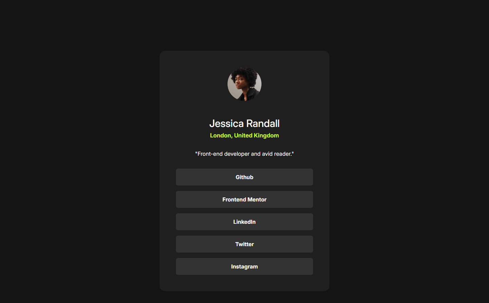

# Frontend Mentor - Social links profile Çözümü

Bu, [Frontend Mentor'daki sosyal link profil sayfasının]((https://www.frontendmentor.io/challenges/social-links-profile-UG32l9m6dQ) bir çözümüdür. Frontend Mentor zorlukları, gerçekçi projeler oluşturarak kodlama becerilerinizi geliştirmenize yardımcı olur.

## İçindekiler
- [Genel Bakış](#genel-bakış)
  - [The challenge](#the-challenge)
  - [Ekran Görüntüsü](#ekran-görüntüsü)
  - [Bağlantılar](#bağlantılar)
- [Süreç](#Süreç)
  - [Kullanılar Teknolojiler](#kullanılar-teknolojiler)
  - [Neler Öğrendim](#neler-öğrendim)
  - [Devam eden gelişim](#devam-eden-gelişim)
  - [Faydalı kaynaklar](#faydalı-kaynaklar)
- [Yazar](#yazar)
- [Teşekkürler](#teşekkürler)

## Genel Bakış

### Ekran Görüntüsü



### Bağlantılar

- Solution URL: [Add solution URL here](https://github.com/jerklex/social-links-profile-main)
- Live Site URL: [Add live site URL here](https://jerklex.github.io/social-links-profile-main/)

## Sürecim

### Kullanılan Teknolojiler

- Semantik HTML5 etiketleme
- CSS özel özellikleri
- Flexbox
- CSS Grid
- Mobil öncelikli yaklaşım
- Bootstrap
### Öğrendiklerim

Kod snippet'lerini eklemek için aşağıdaki örnekleri kullanabilirsiniz:

```html
<div class="d-grid gap-3  mx-auto">
  <a href="" class="btn grey-700 p-2">Github</a>
  <a href="" class="btn grey-700 p-2">Frontend Mentor</a>
  <a href="" class="btn grey-700 p-2">LinkedIn</a>
  <a href="" class="btn grey-700 p-2">Twitter</a>
  <a href="" class="btn grey-700 p-2">Instagram</a>
  </div>
```
### Devam Eden Gelişim

Daha fazla projeye katılıp farklı kütüphaneler öğrenmeyi ve kendimi daha fazla geliştirmeyi planlıyorum.

### Faydalı Kaynaklar

- [Frontend Mentor](https://www.frontendmentor.io/) - Gerçek dünya projeleriyle pratik yapma fırsatı sunan harika bir platform.

## Yazar

- Frontend Mentor - [@jerklex](https://www.frontendmentor.io/profile/jerklex)
- github - [@jerklex](https://github.com/jerklex)

## Teşekkürler

Bu projede size yardımcı olan kişilere teşekkür etmek için bu bölümü kullanabilirsiniz.
